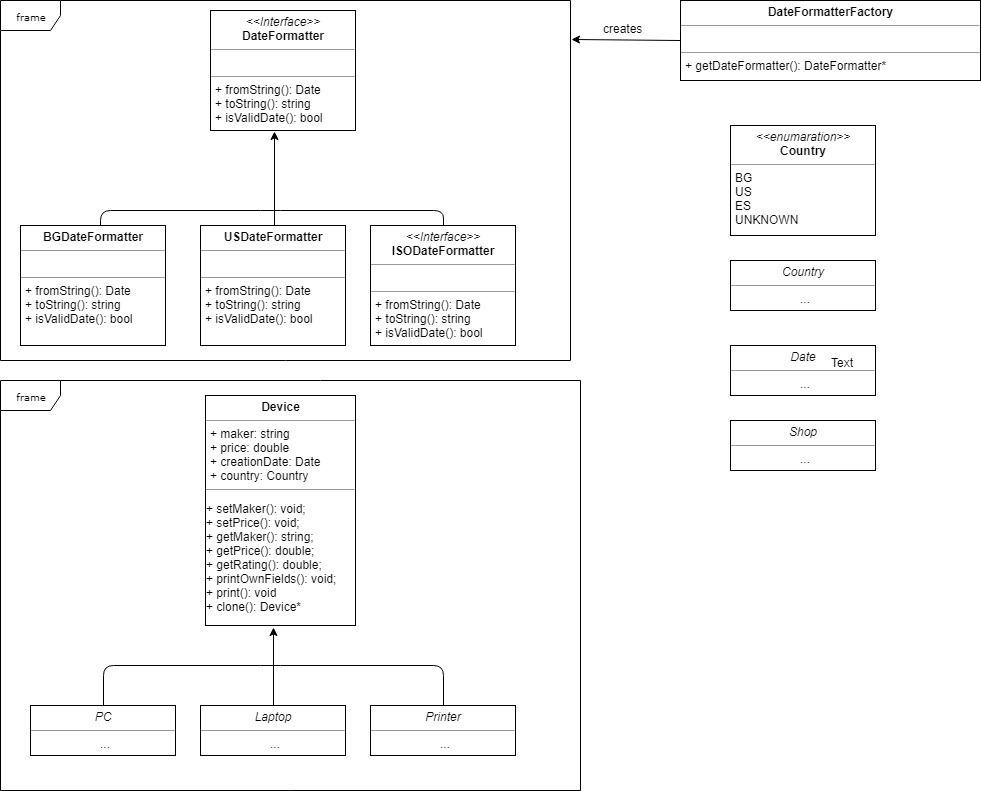

FMI: Clean Code 2018
===============
* The project represents a Shop with several devices such as: PCs, Laptops, Printers, etc.
* Every device has maker, creation date and country. The dates in the project are formatted with a hierarchy of DateFormatter classes based on the country.
===============
To run the Unit tests:
* First build the project with the global Makefile
* Then go to Tester folder and use the Makefile for the tests.

===============
UML Class diagram (not fully completed)
